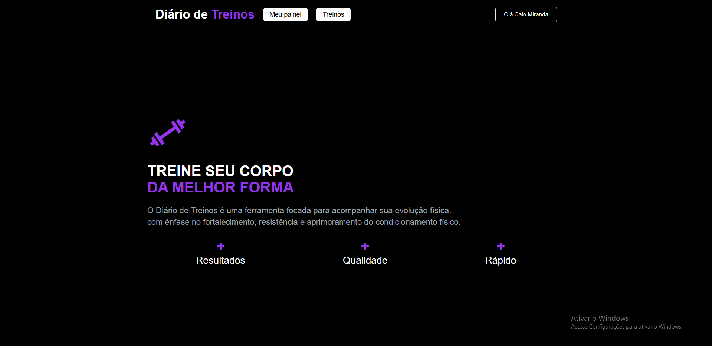
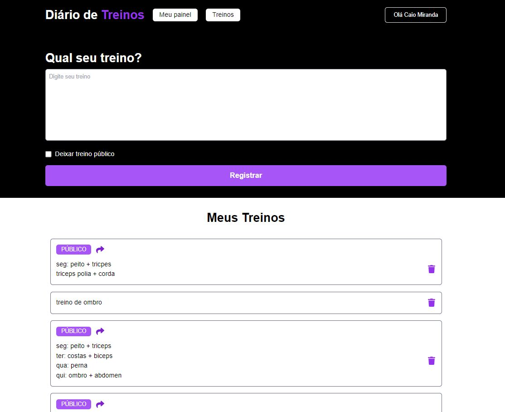
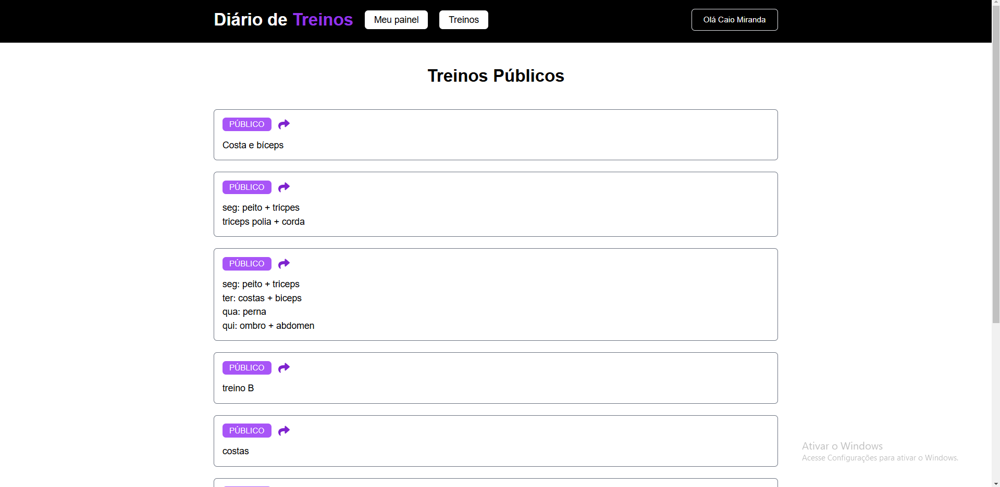

# Diário de Treinos

Essa aplicação se trata de um sistema de anotações de treinos, tanto particulares quanto públicos. Você pode deixar o treino público e até mesmo compartilhá-lo por link. Além disso, possui um sistema de login com o Google, permitindo um acesso fácil e rápido à plataforma.

## ℹ️ Sobre o Projeto

O Diário de Treinos foi desenvolvido para ajudar na organização de treinos, oferecendo a possibilidade de salvar treinos de forma privada ou pública. Além disso, permite compartilhar treinos com outras pessoas por meio de links.

- Linguagem: TypeScript
- Framework: React, Next.js (Pages Router)
- Estilos: Tailwind CSS

## 💡 Funcionalidades:

- Sistema de anotações de treinos (públicos e privados)

- Compartilhamento de treinos por link

- Login com o Google, facilitando o acesso

- Uso de Firebase para armazenamento e autenticação

## 🛠️ Ferramentas Utilizadas

- Next.js (App Router)
- React
- Tailwind CSS
- TypeScript
- Firebase (Autenticação e Banco de Dados)

## 🌍 Acesse o Projeto

A versão ao vivo do Space Games está disponível em: <a href="https://treino-plus.vercel.app/" target="_blank">Deploy</a>

Explore os jogos mais populares diretamente na plataforma!

 

## ⚡ Imagens

<h3>Home</h3>

<h3>Painél</h3>

<h3>Treinos públicos</h3>

